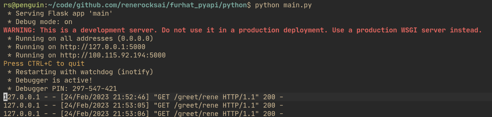
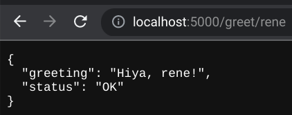

# furhat_pyapi Skill

## Python server 

We use the flask module, and also flask_restful for a quick and easy HTTP API
python server.

The functionalities we want to expose, are "greet" which greets a name
(parameter) with a random greeting - and "shuffle" which randomly shuffles the
list of available greetings. That stuff is implemented in
[python/greets.py](python/greets.py).

[python/main.py](python/main.py) shows how to use our independent python
greeting code from within an API server that speaks JSON over HTTP.

Make sure you have the following python packages installed:

- flask
- flask-restful

Install them how you usually install modules for your projects.

To start the development server from the command line:

```shell
$ cd python 
$ python main.py
```


Then point your browser to: 

- [http://localhost:5000/shuffle](http://localhost:5000/shuffle)
- [http://localhost:5000/greet/rene](http://localhost:5000/greet/rene)

... to get a feel for what the server sends back. You see the JSON responses
that the furhat skill will receive.



## Furhat skill 

Max number of users is set to: 1
Default interaction distance is set to: 1 meter
No other specific requirements. 

After starting the skill, switch to the wizard view of Furhat's web interface.

_(Make sure that the python server is started. See the section above.)_

There, you'll find a button "python" that, when pressed, will fetch the next
random greeting from the python API server - and have Furhat speak it:

```kotlin
    onButton("python") {
        var response = khttp.get("http://localhost:5000/greet/rene");
        var greeting = response.jsonObject.get("greeting");
        print(greeting);
        furhat.say(greeting as String);
    }
```

Note that there's a bit more documentation and links in the Furhat SDK docs, in
the section detailing the Wolfram Alpha API access.
